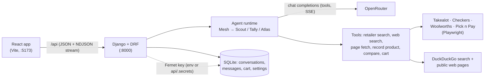

# MarketMesh

MarketMesh is a market research chat tool. You ask a small team of AI agents to research products, compare options, and size up a market; they search South African retailers and the web, read real product pages, and answer with sources. Anything worth keeping goes into a research cart (a shortlist, not a checkout) that you can annotate, compare, and export.

It runs locally as a Django API and a React app, and talks to models through [OpenRouter](https://openrouter.ai) with your own API key.

- [Features](#features)
- [The agent team](#the-agent-team)
- [Quick start](#quick-start)
- [Configuration](#configuration)
- [How it works](#how-it-works)
- [Development](#development)
- [Limitations](#limitations)
- Further reading: [docs/architecture.md](docs/architecture.md) (diagrams, request lifecycle, API) and [docs/decisions.md](docs/decisions.md) (design decisions, security model, attribution, unfinished work)

## Features

**Chat-first research**
- Conversations are saved on the server. Create, rename, reopen, export (Markdown or JSON), and delete them.
- Replies stream token by token. Each message shows which agent is speaking, its role, a live progress line (for example "Searching retailers…"), and an expandable list of the steps it took.
- Press Stop at any time; partial answers are kept and marked as stopped.
- Errors are actionable: an invalid key, a missing model, rate limits, or out-of-credit responses each explain what to do and link to Settings.
- The empty state introduces the team and suggests prompts suited to your research region.

**Grounded answers**
- Products appear as cards with image, seller, price and currency, key specs, a source link, and when the page was retrieved.
- Comparisons render as tables with one verdict per criterion and "Unknown" wherever the sources do not say.
- Every answer lists its sources with retrieval times. Links an agent writes that did not come from a tool result are removed.
- Products recorded from web pages are checked against the fetched page: the name, price, currency, and specs must appear there or they are rejected. Estimates must be labelled as such.
- Retrieved web content is treated as untrusted data (see [Security model](docs/decisions.md#security-model)).

**Research cart**
- Add from product cards, search results, or by asking Mesh in chat ("add the second kettle to my cart"). Agents can only change the cart when your message clearly asks for it.
- Quantities, per-item notes, duplicate detection ("Add another?"), source links, and retrieval times.
- Subtotals are grouped by currency and never converted or combined. Items without a known price are counted separately.
- Select 2 to 6 items and "Compare with Tally" to get a side-by-side comparison in chat.
- Export as CSV or JSON. Clearing requires confirmation.

**Direct retailer search**
- A search page queries Takealot, Checkers, Woolworths, and Pick n Pay live (Playwright) without using the AI.

**Settings**
- OpenRouter key: save, replace, remove, and test. The key is encrypted on the server and never returned to the browser (only its last four characters are shown).
- Default model chosen from OpenRouter's live list of tool-capable models, with search, pricing, and a free-only filter. Optional per-agent model overrides.
- Generation limits: temperature, max tokens, tool rounds per agent, delegations per turn, and request timeout.
- Research region and preferred currency.
- Appearance: System/Light/Dark theme with no flash on load, six accent colours, chat text size, and chat density.
- Data: export or delete all conversations (typed confirmation), export or clear the cart.

## The agent team

| Agent | Handle | Role | Quirk |
|---|---|---|---|
| **Mesh** | `@mesh` | Research lead (orchestrator). Answers by default, delegates to specialists, writes the final recommendation, and makes cart changes on request. | Closes every recommendation with a one-line "Bottom line:". |
| **Scout** | `@scout` | Product researcher. Searches retailers and the web, opens product pages, records products. | Always checks the source: every price comes with where and when it was seen. |
| **Tally** | `@tally` | Comparison specialist. Builds scorecards from products already found or shortlisted. | Loves a concise scorecard and gives exactly one verdict per criterion. |
| **Atlas** | `@atlas` | Market analyst. Competitors, positioning, price tiers, and trends. | Splits every answer into "What the sources say" and "What I would watch". |

Mention one specialist (`@scout find…`) to talk to them directly. Otherwise Mesh answers and brings in specialists as needed. Personas live in [`api/agents/personas.py`](api/agents/personas.py). Avatars are generated in the browser with [DiceBear](https://www.dicebear.com) Notionists from fixed seeds (artwork CC0 1.0 by Zoish; see [attribution](docs/decisions.md#avatars-and-attribution)).

## Quick start

Prerequisites: **Python 3.12+** (`python` on Windows, `python3` on macOS/Linux) and **Node.js 22.12+**.

```bash
npm install          # web and root dependencies
npm run setup:api    # creates api/.venv, installs Python deps and Playwright Chromium, runs migrations
npm run dev          # API on http://127.0.0.1:8000, web on http://localhost:5173
```

Then open http://localhost:5173 and:

1. Go to **Settings → OpenRouter**, paste an API key from [openrouter.ai/keys](https://openrouter.ai/keys), and press **Save key**. The connection is tested automatically.
2. Go to **Settings → Models** and choose a default model. Tick "Free models only" if you want to avoid charges. MarketMesh never picks a model for you.
3. Go back to **Chat** and ask something, or try a suggested prompt.

Direct retailer search (the Search tab) works without an OpenRouter key.

## Configuration

Most configuration happens in the Settings page. The API also reads `api/.env` (git-ignored); copy the template and edit as needed:

```bash
cp api/.env.example api/.env      # PowerShell: Copy-Item api/.env.example api/.env
```

Every variable is documented in [`api/.env.example`](api/.env.example). The important ones:

| Variable | Default | Purpose |
|---|---|---|
| `MARKETMESH_ENCRYPTION_KEY` | *(empty)* | Fernet key that encrypts the OpenRouter key saved in Settings. In development, if unset, one is generated at `api/.secrets/encryption.key` (git-ignored). **Required in production.** Losing or changing it makes the saved key unreadable; re-enter the key in Settings. |
| `OPEN_ROUTER_API_KEY` | *(empty)* | Optional fallback key, used only while no key is saved in Settings. |
| `OPEN_ROUTER_MODEL` | *(empty)* | Optional fallback default model ID. There is no built-in default. |
| `PLAYWRIGHT_HEADLESS` | `false` in development | `true` hides the Chromium windows used for retailer scraping. |
| `SQLITE_PATH` | `db.sqlite3` | Database file, relative to `api/`. |
| `DJANGO_SECRET_KEY`, `DJANGO_ALLOWED_HOSTS` | development fallbacks | **Required** in production. |
| `CORS_ORIGINS` | localhost:5173 | Only needed if the browser calls the API on a different origin. |

Generate an encryption key with:

```bash
python -c "from cryptography.fernet import Fernet; print(Fernet.generate_key().decode())"
```

Web build variables (optional, in `web/.env.local`; see [`web/.env.example`](web/.env.example)): `VITE_API_PROXY_TARGET` (dev proxy target) and `VITE_API_BASE_URL` (API origin for production builds served from another origin).

## How it works



A chat turn is a single streamed HTTP request. The API saves your message, picks who answers (a single `@specialist` mention goes direct; everything else goes to Mesh), and runs the turn in a background thread. Mesh can delegate up to *N* tasks per turn (Settings → Generation) to specialists, who cannot delegate further, so loops are impossible. Every event (tokens, tool steps, finished messages, cart changes) is streamed to the browser as newline-delimited JSON and persisted.

See [docs/architecture.md](docs/architecture.md) for the full diagram, the request lifecycle, the event stream, and the API reference, and [docs/decisions.md](docs/decisions.md) for why it is built this way.

## Development

| Command (from the repo root) | What it does |
|---|---|
| `npm run dev` | Port check, migrate, then start API and web together |
| `npm run dev:api` / `npm run dev:web` | Start one side only |
| `npm run stop:dev` | Kill leftover dev servers on ports 8000 and 5173 |
| `npm run setup:api` | Create or refresh `api/.venv`, install dependencies and Chromium, migrate |
| `npm run migrate:api` | Apply Django migrations |
| `npm test` | API tests then web tests |
| `npm run test:api` | Django test suite (offline: OpenRouter, search, and scrapers are mocked) |
| `npm run test:web` | Vitest unit tests (stream parsing, mentions, event reducer, prices, routing, appearance) |
| `npm run lint` / `npm run typecheck` | oxlint and `tsc -b` on the web app |
| `npm run build` | Typecheck and build the web app into `web/dist` |
| `npm run manage -- <command>` | Run any `manage.py` command inside `api/.venv` |

Useful URLs: Swagger UI at http://127.0.0.1:8000/docs, ReDoc at `/redoc`, the OpenAPI schema at `/openapi.json`, and the Django admin at `/admin/` (create a login with `npm run manage -- createsuperuser`).

Repository layout:

```
api/                Django project
  config/           settings (base, development, production, test), urls
  agents/           personas, prompts, tools, runtime, run registry, web search, page fetch
  research/         conversations and messages, streaming chat endpoint, exports
  cart/             research cart models, services, endpoints
  workspace/        settings singleton, encrypted key storage, OpenRouter settings endpoints
  catalog/          direct retailer search endpoint
  retailers/        Playwright scrapers for the four retailers
  history/          search-run audit log (admin only)
  core/             health, errors, OpenAPI schema, crypto, OpenRouter client
web/                React 19 + TypeScript + Vite + Tailwind 4 + shadcn/ui
  src/components/   chat, cart, settings, store (search), layout, agents, ui
  src/lib/          API client, NDJSON stream, mentions, prices, appearance, avatars
docs/               architecture and design decisions
scripts/            Node helpers behind the npm scripts
```

### Production notes

There is no Dockerfile or CI configuration. To run the API on Linux/macOS, set `DJANGO_SECRET_KEY`, `DJANGO_ALLOWED_HOSTS`, and `MARKETMESH_ENCRYPTION_KEY`, then from `api/`:

```bash
python -m pip install -r requirements.txt
python -m playwright install --with-deps chromium
DJANGO_SETTINGS_MODULE=config.settings.production python manage.py migrate --noinput
DJANGO_SETTINGS_MODULE=config.settings.production python manage.py collectstatic --noinput
gunicorn -c gunicorn.conf.py
```

Keep Gunicorn at one worker (the default): chat runs, cancellation, and Playwright sessions are coordinated in-process. Serve `web/dist` as static files and proxy `/api/` to the API with response buffering off and a read timeout of at least 180 seconds, so chat streams arrive live.

## Limitations

- **Single user.** There are no accounts. Everyone who can reach the API shares one set of settings, one OpenRouter key, one cart, and one conversation history. Do not expose it to the internet without putting authentication in front of it.
- **One process.** Running turns are tracked in memory, so use a single API process. A turn that was running when the server restarted is marked as interrupted.
- **Retailer scraping is fragile.** The four retailer sites change their markup and may block automated browsers. A full four-store search can take one to two minutes, and searches run one at a time.
- **Model quality varies.** Agents need tool calling, and smaller free models follow instructions less reliably. Answers can still be wrong; always check the source before buying.
- **No currency conversion and no price history.**

The full list, including unfinished capabilities, is in [docs/decisions.md](docs/decisions.md#limitations-and-unfinished-work).

## Contributing

Contributions are welcome. See [CONTRIBUTING.md](CONTRIBUTING.md) for setup, the checks to run, and the project rules.

## License

[MIT](LICENSE). Agent avatars use DiceBear (MIT) with Notionists artwork by Zoish (CC0 1.0); see [attribution](docs/decisions.md#avatars-and-attribution).
