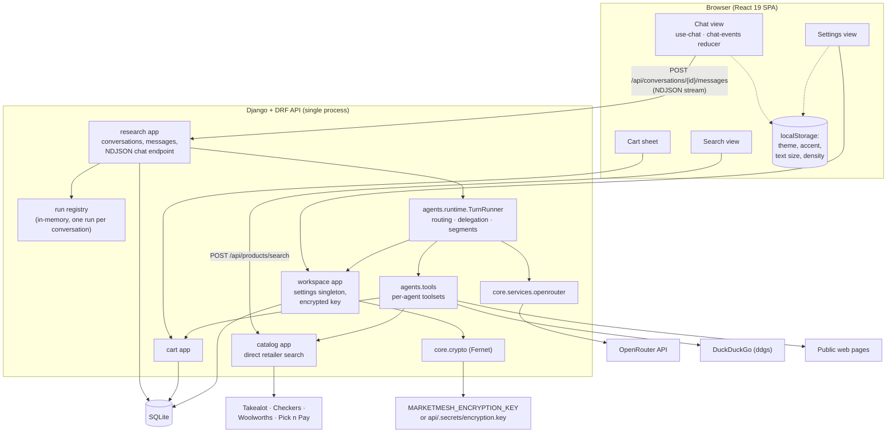

# Architecture

This document describes how MarketMesh is put together: the components, how a chat turn flows through them, the streamed event format, and the HTTP API. Design rationale is in [decisions.md](decisions.md).

## Components



| Piece | Where | Responsibility |
|---|---|---|
| Personas | `api/agents/personas.py` | Names, handles, roles, quirks, intros, avatar seeds, aliases. The single source of truth for the roster; the web app reads it from `GET /api/agents`. |
| Prompts | `api/agents/prompts.py` | Shared rules (grounding, no currency conversion, untrusted content) plus per-agent instructions and the research context injected into each call. |
| Tools | `api/agents/tools.py` | Tool schemas and handlers, argument validation, and which agent gets which tools. |
| Runtime | `api/agents/runtime.py` | Routing, the tool-calling loop, delegation, message segments, link checking, cancellation, and event emission. |
| Run registry | `api/agents/run_registry.py` | Tracks the active run per conversation and its cancel flag. In-memory, so the API must run as one process. |
| Page fetch | `api/agents/page_fetch.py` | Fetches public http(s) pages only (no loopback, private, or link-local addresses, re-checked on redirects), caps size at 1.5 MB, and extracts text and structured product data. |
| OpenRouter client | `api/core/services/openrouter.py` | `POST /chat/completions` (streamed), `GET /key`, `GET /models?supported_parameters=tools`; maps HTTP failures to error codes such as `invalid_key` or `rate_limited`. |
| Crypto | `api/core/crypto.py` | Fernet encryption of the saved OpenRouter key with a key kept outside the database. |

### Who can use which tool

| Agent | Tools |
|---|---|
| Mesh (orchestrator) | `delegate`, `view_cart`; plus `add_to_cart` and `remove_from_cart` only when the user's message asks for a cart change |
| Scout (researcher) | `search_retailers` (South Africa region only), `web_search`, `fetch_page`, `record_product` |
| Tally (comparer) | `submit_comparison`, `fetch_page`, `view_cart` |
| Atlas (analyst) | `web_search`, `fetch_page` |

Specialists never receive `delegate`, which is what makes delegation loops impossible.

## Request lifecycle

```mermaid
sequenceDiagram
    autonumber
    actor U as User
    participant W as Web (use-chat)
    participant V as ConversationMessagesView
    participant R as Run registry
    participant T as TurnRunner (background thread)
    participant O as OpenRouter
    participant X as Tools

    U->>W: Type message, press Enter
    W->>W: Show optimistic user message
    W->>V: POST /api/conversations/{id}/messages<br/>Accept: application/x-ndjson
    V->>R: start(conversation) — 409 if a run is active
    V->>V: Save user message, set title
    V-->>W: {"type":"run", run_id, user_message}
    V->>T: Start thread, stream events from a queue
    T->>T: Load settings, decrypt key, route message<br/>(@specialist → direct, else Mesh)
    T-->>W: agent_start (Mesh)
    loop Tool rounds (≤ max_tool_rounds)
        T->>O: chat/completions (stream, tools)
        O-->>T: tokens / tool calls
        T-->>W: token …
        T-->>W: tool_start
        T->>X: Run tool (validated args, untrusted output wrapped)
        X-->>T: Result
        T-->>W: tool_end
        opt Mesh calls delegate (≤ max_delegations, deduplicated)
            T-->>W: message (Mesh segment so far) or message_removed if empty
            T-->>W: agent_start (specialist, with task)
            T->>O: Specialist loop (cannot delegate)
            T-->>W: token / tool_start / tool_end
            T-->>W: message (specialist final)
            T-->>W: agent_start (new Mesh segment)
        end
    end
    T->>T: Strip links not seen in tool results, save message
    T-->>W: message (final)
    opt Cart changed
        T-->>W: cart_changed → web refetches /api/cart
    end
    T->>R: finish(run)
    T-->>W: {"type":"done","status":"complete"}

    Note over U,W: Stop → POST /api/runs/{run_id}/cancel<br/>sets the cancel flag; partial messages are saved as "cancelled"
```

Details worth knowing:

- **History and context.** Each call includes the last 12 messages plus a research context: products already recorded in the conversation (with keys), the user's cart when relevant, the region, and the preferred currency. This shared context is how agents avoid repeating research.
- **Segments.** Mesh's reply is split around delegations so the conversation reads in order: Mesh's plan, the specialist's findings, then Mesh's synthesis. An empty pre-delegation segment is deleted and announced with `message_removed`.
- **Heartbeats.** If no event is produced for 15 seconds the stream sends `{"type":"ping"}` so proxies keep the connection open.
- **Disconnects.** If the browser disconnects, the run is cancelled. Reopening a conversation whose run was interrupted (for example by a server restart) marks leftover streaming messages as cancelled.
- **Errors.** Failures become an `error` event. If an agent had already started (for example OpenRouter rejected the key or rate-limited the call), the error is also saved on that message (`payload.error`) so it survives a reload. Configuration errors found before any agent starts (`missing_key`, `missing_model`, `encryption_unavailable`) are sent as events only.

## Stream events

Each line of the response body is one JSON object.

| `type` | Fields | Meaning |
|---|---|---|
| `run` | `run_id`, `conversation`, `user_message` | Turn accepted. The client swaps its optimistic message for the saved one and stores `run_id` for Stop. |
| `agent_start` | `message` | A new assistant message (one per agent segment) has started streaming. |
| `token` | `message_id`, `text` | Text delta for that message. |
| `tool_start` | `message_id`, `tool`, `label` | A tool call started (shown as the live progress line). |
| `tool_end` | `message_id`, `tool`, `label`, `ok`, `summary` | A tool call finished; appended to the message's activity list. |
| `message` | `message` | Final state of a message: content, status, products, sources, comparison, cart actions, error. |
| `message_removed` | `message_id` | An empty orchestrator segment was deleted. |
| `cart_changed` | – | The cart was modified by an agent; refetch it. |
| `error` | `error: {code, message, retry_after?}` | Turn-level failure, such as `missing_key`, `invalid_key`, `missing_model`, `rate_limited`, `insufficient_credits`, `model_unavailable`, `timeout`, or `encryption_unavailable`. |
| `ping` | – | Heartbeat. |
| `done` | `status: complete \| cancelled \| error` | Last line of the stream. |

## Data model

| Model | App | Notes |
|---|---|---|
| `Conversation` | research | UUID primary key, title, timestamps. |
| `Message` | research | Role (`user`/`assistant`), agent ID, content, status (`streaming`, `complete`, `cancelled`, `error`), and a JSON `payload` holding products, sources, activity, comparison, cart actions, task, and errors. |
| `CartItem` | cart | Product key, title, URL, seller, source, image, price text, amount and currency (decimal, never converted), specs, notes, quantity, retrieval time, originating conversation. |
| `WorkspaceSettings` | workspace | Singleton row: encrypted OpenRouter key and its last-four hint, default and per-agent models, generation limits, region, and currency. |
| `SearchRun`, `SearchRunProduct` | history | Audit log of direct retailer searches, visible in the admin. |

## HTTP API

All paths are under `/api` with no trailing slash. Bodies are JSON. Errors have the shape `{"detail": ...}`; validation errors return 422. The live OpenAPI schema is at `/openapi.json` (Swagger UI at `/docs`).

| Method | Path | Purpose |
|---|---|---|
| GET | `/health` | Health check. |
| GET | `/agents` | Agent roster and avatar style. |
| GET, POST, DELETE | `/conversations` | List (newest first), create, or delete all (`{"confirm":"DELETE"}`; 409 while a run is active). |
| GET | `/conversations/export?format=markdown\|json` | Export all conversations. |
| GET, PATCH, DELETE | `/conversations/{id}` | Open with messages, rename (`{"title"}`), delete (409 while running). |
| POST | `/conversations/{id}/messages` | Send `{"content", "cart_item_ids"?}` and receive the NDJSON event stream. 409 if a run is already active. |
| GET | `/conversations/{id}/export?format=markdown\|json` | Export one conversation. |
| POST | `/runs/{run_id}/cancel` | Stop a running turn. |
| GET, POST, DELETE | `/cart` | Read the cart with per-currency subtotals; add `{"product", "quantity"?, "increment"?, "conversation_id"?}` (reports duplicates); clear with `{"confirm":"CLEAR"}`. |
| PATCH, DELETE | `/cart/{item_id}` | Update quantity or notes; remove an item. |
| POST | `/cart/import` | One-time import of the legacy browser cart. |
| GET | `/cart/export?format=csv\|json` | Export the cart. |
| GET, PATCH | `/settings` | Read settings (key status only, never the key) and update models, generation limits, region, currency. |
| PUT, DELETE | `/settings/openrouter-key` | Save (encrypted) or remove the OpenRouter key. |
| POST | `/settings/openrouter/test` | Test the saved key or a candidate `{"api_key"}` via OpenRouter's `/key` endpoint. |
| GET | `/settings/openrouter/models?refresh=1` | Tool-capable models from OpenRouter (cached). |
| POST | `/products/search` | Direct retailer search: `{"query", "retailers"?, "max_results"?}`. |

## Web app structure

- **Routing** is hash-based (`#/chat/{id}`, `#/search`, `#/settings/{section}`) in `src/hooks/use-route.ts`. The chat and search views stay mounted when hidden, so a running answer keeps streaming while you browse settings.
- **State** comes from three providers: `WorkspaceProvider` (agents and settings), `CartProvider` (the server cart), and the `useChat` hook (the open conversation and its run).
- **Streaming**: `src/lib/stream.ts` parses NDJSON chunks; `src/components/chat/chat-events.ts` is a pure reducer that applies each event to the conversation (unit tested).
- **Appearance** is applied by an inline script in `index.html` before first paint (theme class plus `data-accent`, `data-text-size`, `data-density` on `<html>`), then managed by `next-themes` and `src/lib/appearance.ts`.
